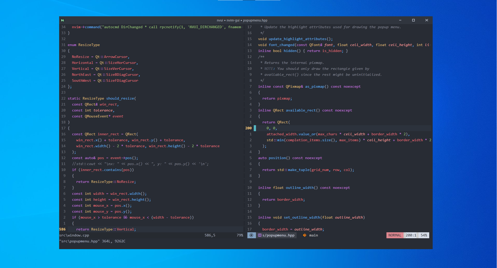
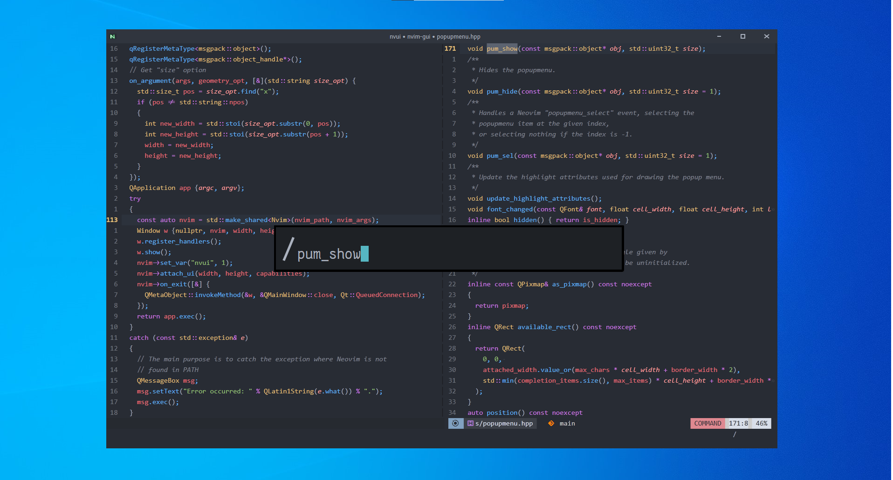
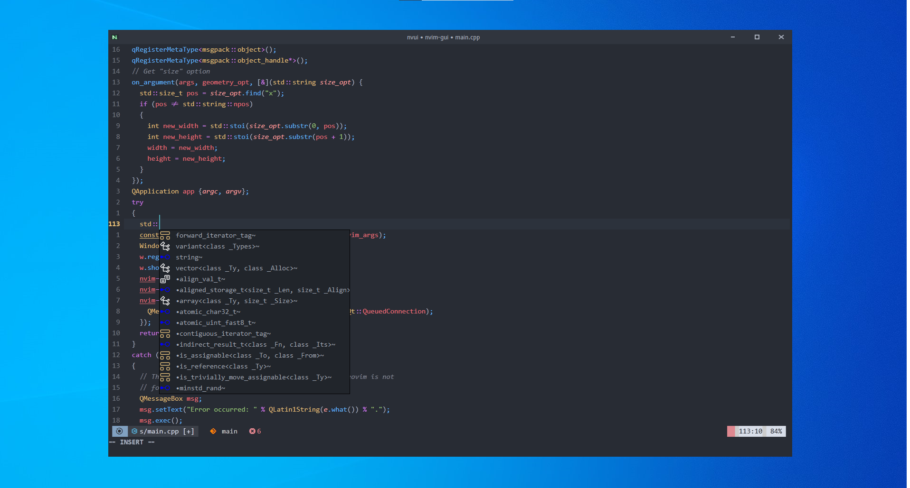
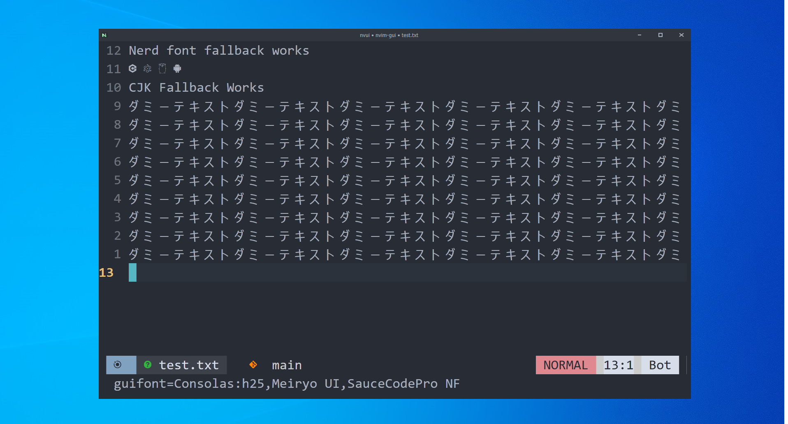

# NVUI

## Featuring
<li> External Command Line
<li> Configurable positions, sizes, colors, border width, border color, etc.

<li> External Popup Menu
<li> Configurable colors, background colors, icon sizes, alignment, border width, border color, etc.

<li> Cross-platform Qt, DirectWrite on Windows

<li> Font Fallback (see guifont in the bottom left)
<li> Configurable through "set guifont"

<li> More to Come!